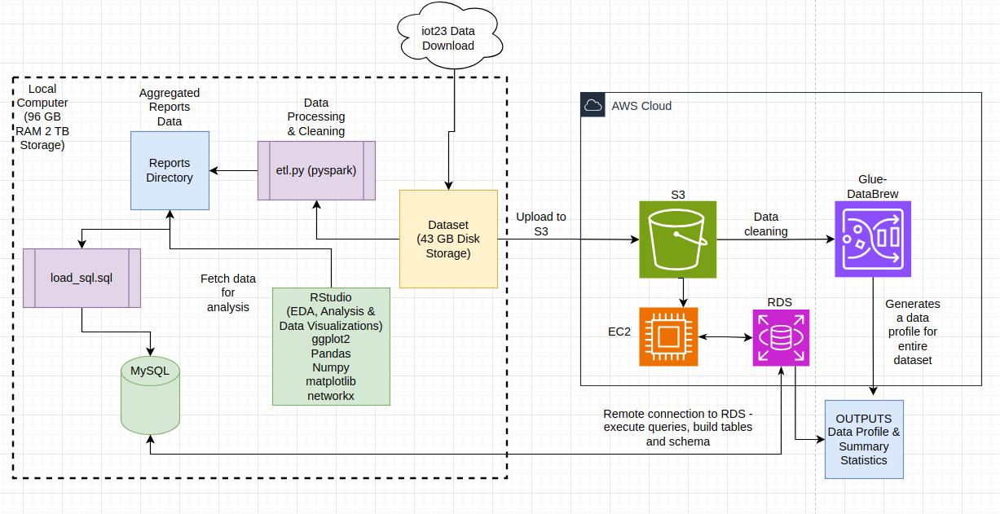

# Characterizing Volumetric DDoS Attacks in IoT Network Traffic
This project consisted of a paper and analysis done using the iot23 dataset created at CTU University's Stratosphere Laboratory. See paper for more details as well as the code used in the analysis. 

